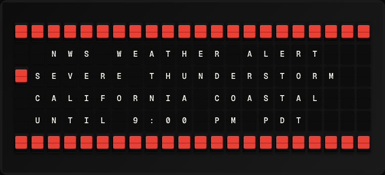

# Weather Alerts Plugin

Display active National Weather Service severe weather alerts for your area.



**→ [Setup Guide](./docs/SETUP.md)**

## Overview

The Weather Alerts plugin queries the NWS Alerts API for active severe weather alerts in a configured US state or geographic area. It shows the most urgent active alert (tornado warning, severe thunderstorm, etc.). No API key required.

## Template Variables

| Variable | Description | Example |
|---|---|---|
| `lightning.event` | Alert event name (e.g. Tornado Warning) | `Tornado Warning` |
| `lightning.headline` | Short alert headline | `...Tornado Warning...` |
| `lightning.severity` | Alert severity (Extreme/Severe/Moderate/Minor) | `Extreme` |
| `lightning.alert_count` | Total number of active alerts in the state | `3` |
| `lightning.all_clear` | Yes if no active alerts | `No` |

## Example Templates

```
WEATHER ALERTS
{{lightning.alert_count}} active alerts
{{lightning.event}}
{{lightning.severity}}
{{lightning.headline}}

```

## Configuration

| Setting | Name | Description | Required |
|---|---|---|---|
| `state` | US State | Two-letter US state code to filter alerts (e.g. CA, NY, TX). | Yes |

## Features

- NWS real-time alerts API
- Configurable US state filter
- Severity-ranked alert display
- All-clear indicator
- No API key required

## Author

FiestaBoard Team
